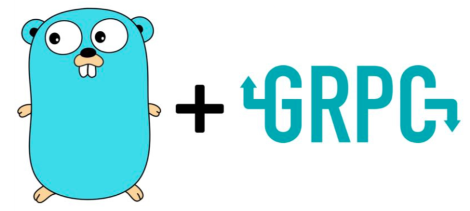

 

# go-gRPC-examples

This repo contains examples and implementations of different types of GRPC services and APIs using [Golang](https://golang.org/).

# What is GRPC ?

[gRPC](https://grpc.io/docs/) ( gRPC Remote Procedure Calls ) is an open source remote procedure call ( RPC ) system initially developed at Google in 2015. 
It uses HTTP/2 for transport, Protocol Buffers as the interface description language, and provides features such as authentication, bidirectional streaming and flow control, blocking or nonblocking bindings, and cancellation and timeouts.
It generates cross-platform client and server bindings for many languages. Most common usage scenarios include connecting services in microservices style architecture and connect mobile devices, browser clients to backend services.

# Types of RPCs

### Unary RPC

The simplest type of RPC where the client sends a single request and gets back a single response.

Once the client calls a stub method, the server is notified that the RPC has been invoked with the client’s metadata for this call, the method name, and the specified deadline if applicable.
The server can then either send back its own initial metadata (which must be sent before any response) straight away, or wait for the client’s request message. Which happens first, is application-specific.
Once the server has the client’s request message, it does whatever work is necessary to create and populate a response. The response is then returned (if successful) to the client together with status details (status code and optional status message) and optional trailing metadata.
If the response status is OK, then the client gets the response, which completes the call on the client side.

Check examples : [Unary](./unary)

### Server streaming RPC

A server-streaming RPC is similar to a unary RPC, except that the server returns a stream of messages in response to a client’s request. After sending all its messages, the server’s status details (status code and optional status message) and optional trailing metadata are sent to the client. This completes processing on the server side. The client completes once it has all the server’s messages.

Check examples : [Server streaming](./stream/server-streaming/)

### Client streaming RPC

A client-streaming RPC is similar to a unary RPC, except that the client sends a stream of messages to the server instead of a single message. The server responds with a single message (along with its status details and optional trailing metadata), typically but not necessarily after it has received all the client’s messages.

Check examples : [Client streaming](./stream/client-streaming/)

### Bidirectional streaming RPC

In a bidirectional streaming RPC, the call is initiated by the client invoking the method and the server receiving the client metadata, method name, and deadline. The server can choose to send back its initial metadata or wait for the client to start streaming messages.

Client- and server-side stream processing is application specific. Since the two streams are independent, the client and server can read and write messages in any order. For example, a server can wait until it has received all of a client’s messages before writing its messages, or the server and client can play “ping-pong” – the server gets a request, then sends back a response, then the client sends another request based on the response, and so on.

Check examples : [Bidirectional streaming](./stream/bi-directional-streaming/)

# Maintainer

[Kumar Saurabh](https://in.linkedin.com/in/itsksaurabh)

## License

[MIT](LICENSE) © Kumar Saurabh
